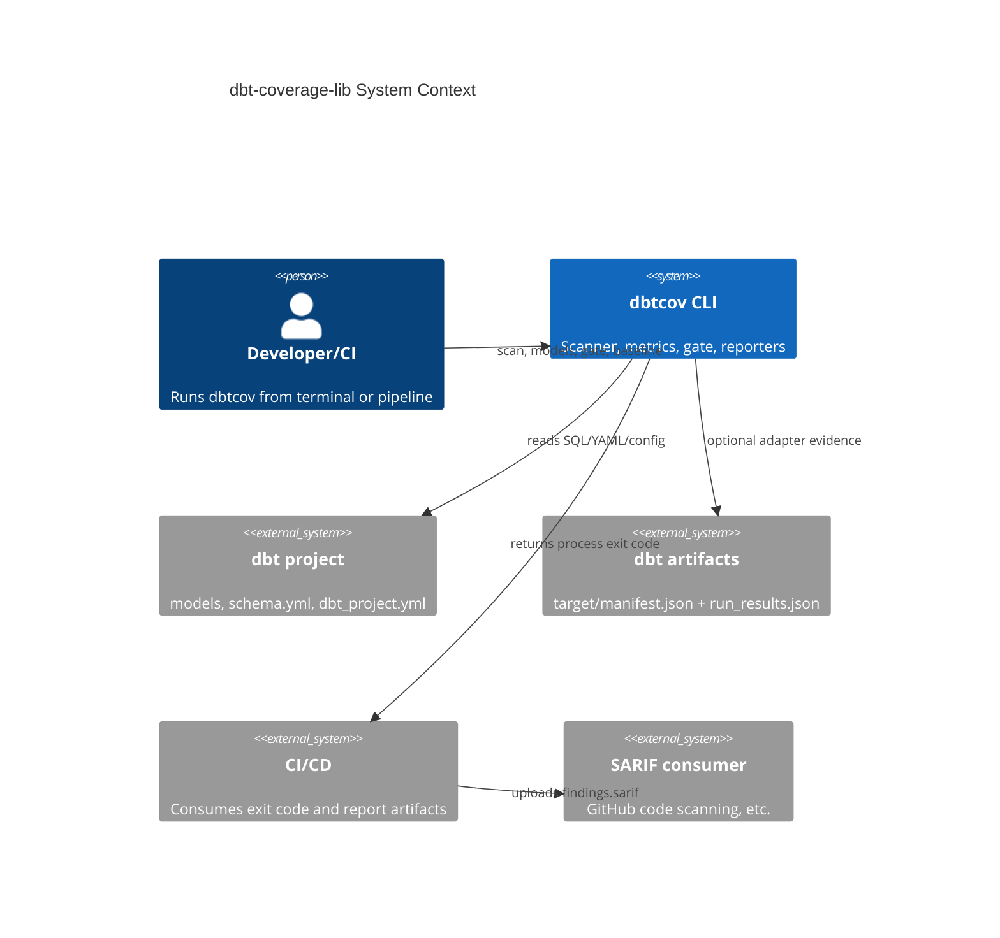
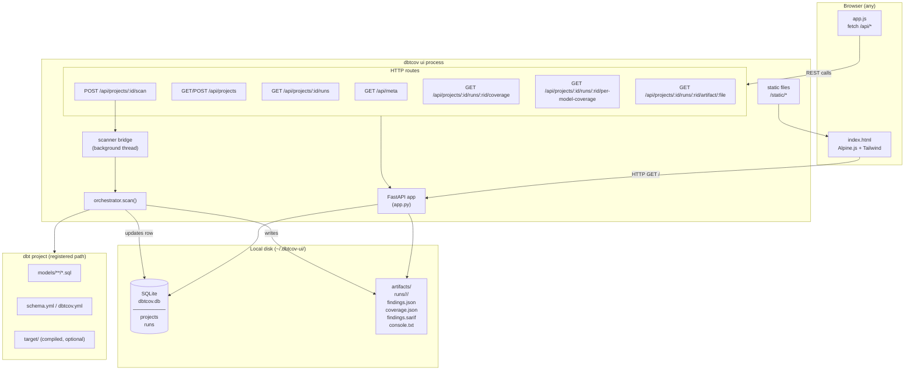

# dbt-coverage-lib - High-Level Design

## 1. Purpose

dbt-coverage-lib provides a single quality-control plane for dbt projects.
It combines static SQL analysis, dbt metadata, adapter evidence, coverage metrics,
and policy gates into one scan result and one CI decision.

Primary outcomes:
- Detect data-quality, performance, architecture, refactor, testing, security, and governance issues.
- Compute multiple coverage dimensions from declarations and execution evidence.
- Produce machine-readable outputs for automation and human-readable outputs for triage.
- Serve a web UI for interactive project registration, scan triggering, and historical trend analysis.

## 2. User-Facing Commands

The CLI surface is organized around seven commands:
- `dbtcov init`: scaffold a `dbtcov.yml`.
- `dbtcov scan`: run analysis, optional gate, and emit reports.
- `dbtcov models`: read `findings.json` and show per-model risk table.
- `dbtcov gate`: re-evaluate gate against an existing `findings.json`.
- `dbtcov baseline capture`: snapshot current findings into baseline JSON.
- `dbtcov baseline diff`: compare current findings to baseline.
- `dbtcov ui`: launch the FastAPI web dashboard (`--host`, `--port`).

Recommended daily workflow:
1. `dbtcov scan --path . --format console json sarif --out dbtcov-out`
2. `dbtcov models --results dbtcov-out/findings.json --sort score`
3. `dbtcov gate --results dbtcov-out/findings.json --path .`

Optional interactive workflow:
1. `dbtcov ui --host 0.0.0.0 --port 8000`
2. Register projects and trigger scans from the browser dashboard.

## 3. System Context



## 4. Component Architecture

```mermaid
flowchart TB
    subgraph CLI[CLI]
        INIT[init]
        SCAN[scan]
        MODELS[models]
        GATE[gate]
        BASELINE[baseline capture/diff]
        UI_CMD[ui]
        ORCH[orchestrator.scan]
    end

    subgraph CORE[Core Pipeline]
        DISC[project discovery]
        SS[source scanner]
        RENDER[renderer: AUTO/MOCK/COMPILED]
        PARSE[sql parser]
        GRAPH[analysis graph]
        CX[complexity]
        ENG[rule engine + skip tracking]
        WR[waiver resolver + baseline]
        COV[coverage aggregator]
        SUM[model summaries]
    end

    subgraph PACKS[Rule Packs]
        QP[quality: Q001-Q007]
        PP[performance: P001-P010]
        AP[architecture: A001-A005]
        RP[refactor: R002-R006]
        SP[security/governance: S001-S002 G001]
        TP[testing: T001-T003]
    end

    subgraph AD[Adapters]
        SCHED[scheduler]
        DBT[dbt-test adapter]
        SQLF[sqlfluff adapter]
        PLUGINS[entry-point adapters]
    end

    subgraph OUT[Outputs]
        RESULT[ScanResult]
        CONSOLE[console reporter]
        JSON[findings.json]
        SARIF[findings.sarif]
        COVJSON[coverage.json]
        MODELVIEW[models table/json]
    end

    subgraph WEB[Web UI — dbt_coverage_ui]
        FAPI[FastAPI app]
        SQLITE[SQLite store]
        STATIC[static: HTML/JS/CSS]
        SCANNER_BRIDGE[scanner bridge]
    end

    SCAN --> ORCH
    GATE --> RESULT
    MODELS --> JSON
    UI_CMD --> FAPI

    ORCH --> DISC --> SS --> RENDER --> PARSE --> GRAPH
    PARSE --> CX
    GRAPH --> ENG
    CX --> ENG
    PACKS --> ENG

    ORCH --> SCHED --> DBT
    ORCH --> SCHED --> SQLF
    ORCH --> SCHED --> PLUGINS

    DBT --> ENG
    DBT --> COV
    SQLF --> ENG
    PLUGINS --> ENG

    ENG --> WR --> RESULT
    COV --> RESULT
    SUM --> RESULT

    RESULT --> CONSOLE
    RESULT --> JSON
    RESULT --> SARIF
    RESULT --> COVJSON
    JSON --> MODELVIEW

## 5. End-to-End Scan Flow

```mermaid
sequenceDiagram
    actor User
    participant CLI as scan command
    participant ORCH as orchestrator
    participant ENG as rule engine
    participant COV as coverage
    participant RPT as reporters

    User->>CLI: dbtcov scan --path ... --format console json sarif
    CLI->>ORCH: scan(path, config, overrides)
    ORCH->>ORCH: discover/load config and project
    ORCH->>ORCH: render + parse + graph + complexity
    ORCH->>ORCH: run adapters
    ORCH->>ENG: run_with_skips(parsed_nodes)
    ORCH->>ORCH: apply waivers and baseline
    ORCH->>COV: compute_all(...)
    ORCH->>ORCH: build model_summaries + render_stats
    ORCH-->>CLI: ScanBundle(result, config)
    CLI->>RPT: emit reports
    CLI->>CLI: fatal checks (no models / parse-failure ratio)
    CLI-->>User: exit code
```

## 6. Output Contract

When `--format` includes `json` or `sarif`, output directory includes:
- `findings.json`: canonical `ScanResult`.
- `findings.sarif`: SARIF 2.1 report.
- `coverage.json`: coverage slice only.

`ScanResult` includes these top-level data groups:
- Findings, coverage metrics, render stats.
- Complexity map.
- Test results and adapter invocations.
- Skip report (`check_skip_summary`, aggregated/per-pair lists).
- Per-model assessment (`model_summaries`).

`dbtcov models` is read-only and consumes `findings.json`; it does not rerun scan.

## 7. Configuration and Render Strategy

Configuration is loaded from:
1. `--config` if supplied.
2. auto-discovered `dbtcov.yml`.
3. defaults.

Render behavior:
- Default is `render.mode=AUTO`.
- AUTO selects COMPILED when compiled coverage meets `render.compiled_min_coverage`.
- Otherwise AUTO falls back to MOCK.
- CLI can force with `--render-mode` and `--compiled-dir`.

## 8. Coverage and Gate Model

Coverage dimensions are registry-driven and include:

| Dimension | Description |
|---|---|
| `test` | models with ≥1 declared data test |
| `doc` | column-level doc ratio across models |
| `unit` | models with ≥1 unit test |
| `column` | columns with ≥1 test |
| `pii` | PII-tagged columns with masking evidence |
| `test_meaningful` | tests passing semantic quality checks |
| `test_weighted_cc` | test coverage weighted by cyclomatic complexity |
| `test_unit` | unit test presence weighted by complexity |
| `complexity` | models below complexity threshold |

Gate behavior:
- Optional during `scan` (`--fail-on tier-1|tier-2|never`) or standalone with `gate` command.
- Uses severity tier plus threshold blocks.
- Works with suppression/baseline metadata.

Fatal scan exits are reserved for structural failures:
- Exit 2: no models discovered.
- Exit 3: parse failure ratio >= 90%.

## 9. Rule Packs

Rules are grouped into six domain packs, each registered via the rule registry:

| Pack | Rules | Focus |
|---|---|---|
| **Quality** | Q001–Q007 | `SELECT *`, missing PK, high complexity, undocumented, naming, casing |
| **Performance** | P001–P010 | cross join, non-SARGable, self-join, unbounded window, `COUNT(DISTINCT)` over, fan-out join, `ORDER BY` sans limit, deep CTE, over-referenced view, incremental missing key |
| **Architecture** | A001–A005 | layer violation, fan-in, direct source reference, cycle, leaky abstraction |
| **Refactor** | R002–R006 | god model, single-use CTE, dead CTE, duplicate expression, duplicate CASE |
| **Security/Governance** | S001–S002, G001 | PII unmasked, hardcoded secret, missing owner |
| **Testing** | T001–T003 | unexecuted test, no unit tests, malformed unit test |

## 10. Per-Model Assessment

`model_summaries` provides triage-ready model rows:
- parse and render status
- test/doc posture
- per-tier rule ids
- data/unit test counts
- unexecuted test count
- waiver count
- skip count
- score (0-100)

Current scoring is graduated and bounded:
- base 100
- no tests: -25
- doc penalty: up to -15 (scaled)
- tier-1 rules: -10 each, cap -40
- tier-2 rules: -3 each, cap -20
- unexecuted tests: -5 each, cap -15
- parse failed: -10
- render uncertain (if parse succeeds): -5
- skip penalty: up to -5

`dbtcov models` presents score, tests, unit, docs, parse, skips, findings, and file.

## 11. Baseline and Waiver Governance

Waivers and baseline are applied before gate and model scoring consume findings:
- suppressed findings remain in data with provenance.
- expired waivers can produce governance findings.
- baseline capture/diff supports incremental rollout and CI ratcheting.

## 12. Web UI (`dbtcov ui`)

The optional web dashboard (`dbt_coverage_ui` package) is served via FastAPI and Uvicorn:
- **Project registry**: register dbt project paths and names; stored in SQLite (`~/.dbtcov-ui/`).
- **Scan trigger**: POST `/projects/{id}/scan` runs `orchestrator.scan` in a background thread, writing artifacts to `~/.dbtcov-ui/runs/<project>/<run>/`.
- **Stale run recovery**: on startup, any `running` rows whose artifacts exist are promoted to `success`.
- **Trend charts**: Quality Trend (mean score, findings, critical) and Coverage Trend (test%, doc%, unit%) rendered from historical run rows.
- **Run history table**: columns — started, status, mode, score, findings, critical, at-risk, test%, duration.
- **Config editor**: inline YAML editor for `dbtcov.yml` per project.

Data model in SQLite:
- `projects(id, name, path, created_at, last_run_id)`
- `runs(id, project_id, status, started_at, finished_at, render_mode, score_*, findings_*, coverage_*, ...)`

Optional dependencies: `fastapi>=0.110`, `uvicorn[standard]>=0.27`.

### 12a. Infrastructure Diagram — Web UI Runtime



**Request path for a scan:**
1. Browser POSTs to `/api/projects/{id}/scan`
2. FastAPI inserts a `running` row in SQLite and spawns a background thread
3. Thread calls `orchestrator.scan(project_path, ...)` — same engine as `dbtcov scan` CLI
4. On completion, artifacts are written to `~/.dbtcov-ui/runs/<project>/<run>/` and the SQLite row is updated to `success`
5. Browser polls `/api/projects/{id}` (every 3 s) until status changes, then fetches coverage + findings

**Kubernetes deployment** (see `k8s/`):
```
Browser → Ingress → ClusterIP Service (port 8000) → Pod (uvicorn, port 8000)
                                                         └─ hostPath / PVC for ~/.dbtcov-ui/
```

## 13. Deployment

### CI (Jenkinsfile)
A Jenkinsfile drives Docker image build and push to a JFrog container registry, versioned by `IMAGE_TAG`.

### Kubernetes (`k8s/`)
Three manifests deploy the web UI to a `dbt-coverage` namespace:
- `deployment.yaml`: 2-replica `RollingUpdate`, pulls from JFrog registry via `imagePullSecrets`.
- `service.yaml`: ClusterIP service exposing port 8000.
- `ingress.yaml`: Ingress rule routing to the service.

Environment variable `DBTCOV_UI_HOME` overrides the default `~/.dbtcov-ui/` data root.

## 14. Operational Notes

Useful scan options:
- adapter controls: `--adapter`, `--no-adapter`, `--adapter-mode`, `--adapter-report`, `--list-adapters`
- reporter controls: `--format`, `--out`, `--show-suppressed`, `--skip-detail`
- project layout controls: `--path`, `--project-config`
- render controls: `--render-mode`, `--compiled-dir`

This design keeps scan deterministic, offline-first, and resilient: adapter failures are isolated, rule skips are explicit, and outputs remain stable for automation.
