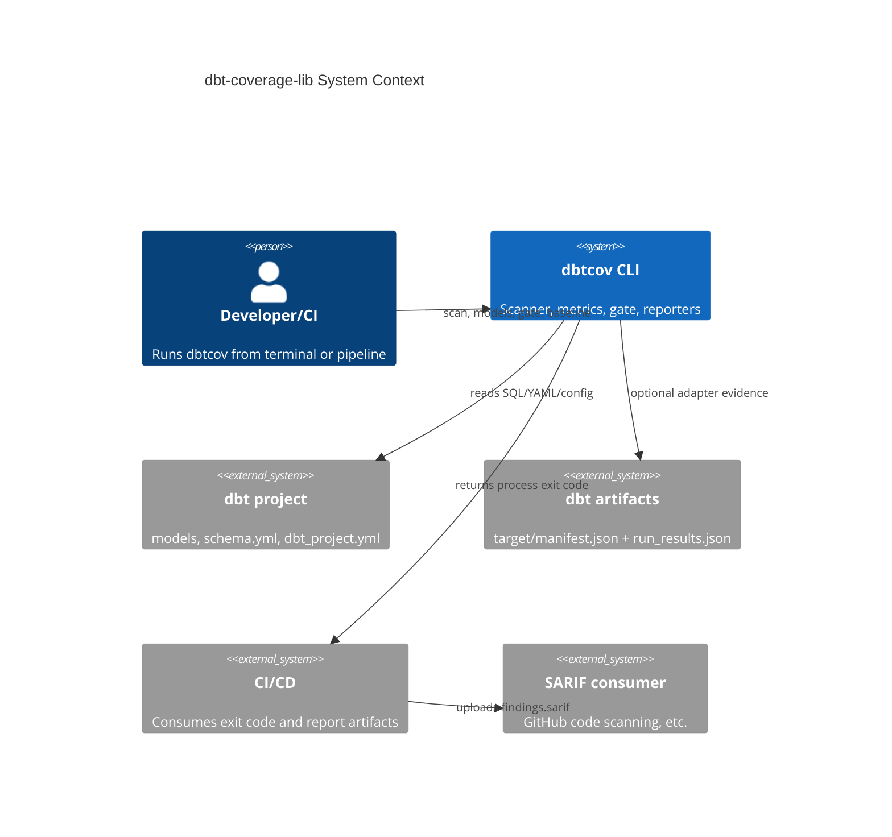
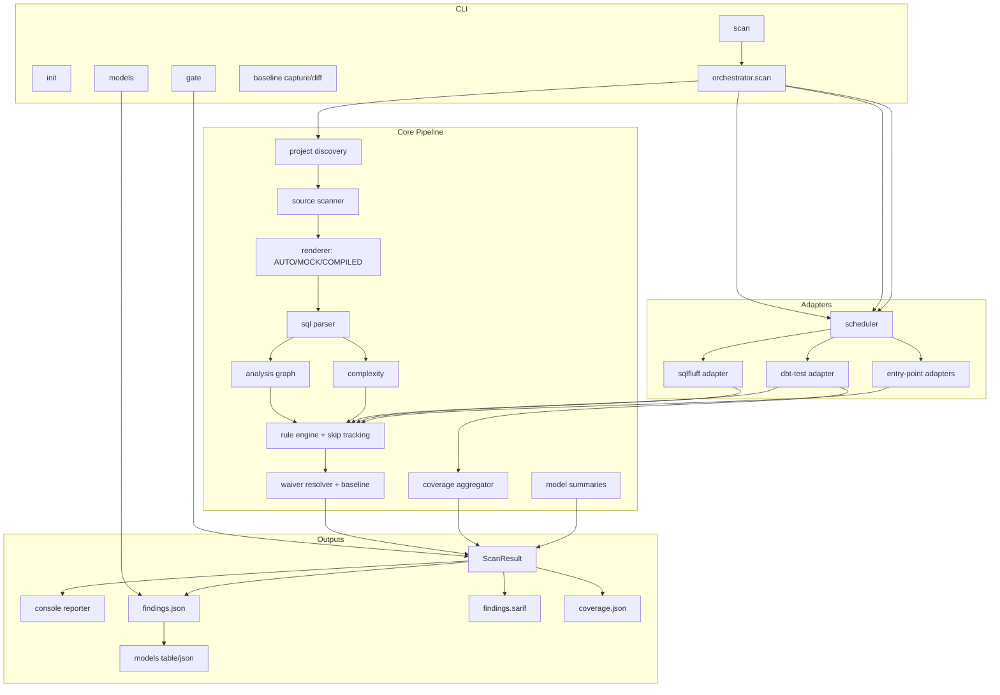
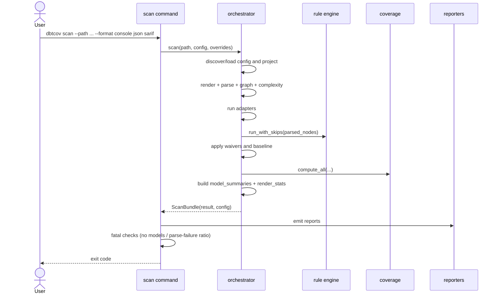

# dbt-coverage-lib - High-Level Design

## 1. Purpose

dbt-coverage-lib provides a single quality-control plane for dbt projects.
It combines static SQL analysis, dbt metadata, adapter evidence, coverage metrics,
and policy gates into one scan result and one CI decision.

Primary outcomes:
- Detect data-quality, performance, architecture, refactor, testing, security, and governance issues.
- Compute multiple coverage dimensions from declarations and execution evidence.
- Produce machine-readable outputs for automation and human-readable outputs for triage.

## 2. User-Facing Commands

The CLI surface is organized around six commands:
- `dbtcov init`: scaffold a `dbtcov.yml`.
- `dbtcov scan`: run analysis, optional gate, and emit reports.
- `dbtcov models`: read `findings.json` and show per-model risk table.
- `dbtcov gate`: re-evaluate gate against an existing `findings.json`.
- `dbtcov baseline capture`: snapshot current findings into baseline JSON.
- `dbtcov baseline diff`: compare current findings to baseline.

Recommended daily workflow:
1. `dbtcov scan --path . --format console json sarif --out dbtcov-out`
2. `dbtcov models --results dbtcov-out/findings.json --sort score`
3. `dbtcov gate --results dbtcov-out/findings.json --path .`

## 3. System Context

## 4. Component Architecture

## 5. End-to-End Scan Flow

## 6. Output Contract

When `--format` includes `json` or `sarif`, output directory includes:
- `findings.json`: canonical `ScanResult`.
- `findings.sarif`: SARIF 2.1 report.
- `coverage.json`: coverage slice only.

`ScanResult` includes these top-level data groups:
- Findings, coverage metrics, render stats.
- Complexity map.
- Test results and adapter invocations.
- Skip report (`check_skip_summary`, aggregated/per-pair lists).
- Per-model assessment (`model_summaries`).

`dbtcov models` is read-only and consumes `findings.json`; it does not rerun scan.

## 7. Configuration and Render Strategy

Configuration is loaded from:
1. `--config` if supplied.
2. auto-discovered `dbtcov.yml`.
3. defaults.

Render behavior:
- Default is `render.mode=AUTO`.
- AUTO selects COMPILED when compiled coverage meets `render.compiled_min_coverage`.
- Otherwise AUTO falls back to MOCK.
- CLI can force with `--render-mode` and `--compiled-dir`.

## 8. Coverage and Gate Model

Coverage dimensions are registry-driven and include:
- `test`, `doc`, `unit`, `column`, `pii`, `test_meaningful`, `test_weighted_cc`, `test_unit`, `complexity`.

Gate behavior:
- Optional during `scan` (`--fail-on tier-1|tier-2|never`) or standalone with `gate` command.
- Uses severity tier plus threshold blocks.
- Works with suppression/baseline metadata.

Fatal scan exits are reserved for structural failures:
- Exit 2: no models discovered.
- Exit 3: parse failure ratio >= 90%.

## 9. Per-Model Assessment

`model_summaries` provides triage-ready model rows:
- parse and render status
- test/doc posture
- per-tier rule ids
- data/unit test counts
- unexecuted test count
- waiver count
- skip count
- score (0-100)

Current scoring is graduated and bounded:
- base 100
- no tests: -25
- doc penalty: up to -15 (scaled)
- tier-1 rules: -10 each, cap -40
- tier-2 rules: -3 each, cap -20
- unexecuted tests: -5 each, cap -15
- parse failed: -10
- render uncertain (if parse succeeds): -5
- skip penalty: up to -5

`dbtcov models` presents score, tests, unit, docs, parse, skips, findings, and file.

## 10. Baseline and Waiver Governance

Waivers and baseline are applied before gate and model scoring consume findings:
- suppressed findings remain in data with provenance.
- expired waivers can produce governance findings.
- baseline capture/diff supports incremental rollout and CI ratcheting.

## 11. Operational Notes

Useful scan options:
- adapter controls: `--adapter`, `--no-adapter`, `--adapter-mode`, `--adapter-report`, `--list-adapters`
- reporter controls: `--format`, `--out`, `--show-suppressed`, `--skip-detail`
- project layout controls: `--path`, `--project-config`
- render controls: `--render-mode`, `--compiled-dir`

This design keeps scan deterministic, offline-first, and resilient: adapter failures are isolated, rule skips are explicit, and outputs remain stable for automation.
