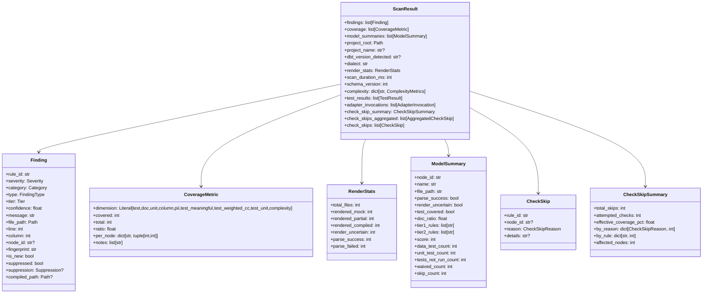
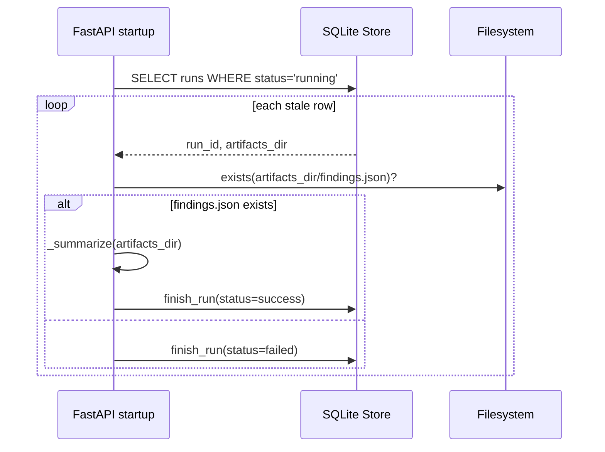

# dbt-coverage-lib - Low-Level Design

## 1. Core Domain Objects



## 2. Orchestrator Implementation Flow

Main entrypoint: `dbt_coverage.cli.orchestrator.scan`.

Algorithm shape:
1. Resolve project root and load project info.
2. Load and merge config (file + CLI overrides).
3. Resolve dialect (`config.dialect` then adapter-derived fallback).
4. Scan sources to build `ProjectIndex`.
5. Select renderer (AUTO/MOCK/COMPILED), render, parse.
6. Build graph and complexity map.
7. Run adapters to collect findings, tests, and invocation metadata.
8. Discover/apply rule overrides; execute rule engine with skip tracking.
9. Merge rule + adapter findings and sort deterministically.
10. Apply waivers and baseline suppressions.
11. Compute coverage dimensions.
12. Build per-model summaries (`_build_model_summaries`).
13. Compute render stats and skip report (`_build_skip_report`).
14. Assemble `ScanResult`.

```mermaid
flowchart TD
    A[start scan()] --> B[find project + load config]
    B --> C[scan_sources]
    C --> D[select renderer]
    D --> E[render_all]
    E --> F[parse_all]
    F --> G[build_graph]
    G --> H[compute complexity]
    H --> I[run adapters]
    I --> J[engine.run_with_skips]
    J --> K[merge + sort findings]
    K --> L[apply waivers/baseline]
    L --> M[compute coverage]
    M --> N[build model summaries]
    N --> O[build render stats + skip report]
    O --> P[construct ScanResult]
```

## 3. Renderer Selection Details

Renderer selection lives in `_select_renderer`:
- If mode is MOCK: always use `JinjaRenderer`.
- If mode is COMPILED: always use `CompiledRenderer`.
- If mode is AUTO:
1. call `CompiledRenderer.is_available(...)`.
2. use COMPILED when compiled hit ratio >= `compiled_min_coverage`.
3. else fallback to MOCK.

Resulting per-node render mode is later collapsed into a dominant mode for rule dispatch (`_dominant_render_mode`).

## 4. Skip Tracking Model

Rule engine emits per-check skip events. Orchestrator aggregates through `_build_skip_report`:
- summary always computed.
- aggregated list always computed.
- per-pair list included based on effective skip-detail config.

Effective coverage for checks:

$$
\text{effective\_coverage\_pct} = 100 \times \left(1 - \frac{\text{total\_skips}}{\text{attempted\_checks}}\right)
$$

clamped to $[0, 100]$.

## 5. Model Summary Construction

`_build_model_summaries` joins four streams keyed by node id:
- parsed node status (`parse_success`, `render_uncertain`)
- coverage per-node tuples (`test`, `doc`)
- findings grouped into tier sets and waived count
- test results grouped by kind and execution
- check skip counts per node

Rows are sorted by `(score, name)` ascending for worst-first triage.

### 5.1 Scoring formula

Current score logic in orchestrator:
- Base: 100
- If no tests: `-25`
- Docs penalty: `-round((1 - doc_ratio) * 15)`
- Tier-1 rules: `-10 * count`, capped at `-40`
- Tier-2 rules: `-3 * count`, capped at `-20`
- Unexecuted tests: `-5 * count`, capped at `-15`
- Parse failed: `-10`
- Else if render uncertain: `-5`
- Skip penalty: up to `-5`
- Final clamp: `max(0, score)`

### 5.2 Output fields consumed by `dbtcov models`

`dbtcov models` uses these columns:
- Score
- Model
- Tests (declared data tests)
- Unit (unit test presence)
- Docs
- Parse
- Skips
- Findings
- File

It supports:
- `--results` (path to findings.json)
- `--min-score` (filter)
- `--sort score|name|tier`
- `--format console|json`

## 6. CLI Command Behaviors

### 6.1 scan

Key implementation points:
- Can list adapters and exit (`--list-adapters`).
- Applies CLI overrides into config shape.
- Optional gate in scan path (`--fail-on tier-1|tier-2|never`).
- Emits selected formats through reporter registry.
- Calls `exit_on_fatal` after report emission.

Fatal exits:
- 2: no models discovered.
- 3: parse-failed ratio >= 90%.

### 6.2 gate

`gate` validates a saved `ScanResult` payload and evaluates with current gate config.
No re-scan performed.

### 6.3 baseline

- `baseline capture`: run scan and write baseline entries.
- `baseline diff`: run scan, load baseline, print added/removed fingerprint sets.

### 6.4 ui

Launches a FastAPI + Uvicorn server that hosts the `dbt_coverage_ui` dashboard.
Options: `--host` (default `127.0.0.1`), `--port` (default `8000`).
Data root: `~/.dbtcov-ui/` or `$DBTCOV_UI_HOME`.

Key API surface:
- `GET /projects` — list registered projects.
- `POST /projects` — register a new project (`{name, path}`).
- `DELETE /projects/{id}` — remove project and all run history.
- `GET /projects/{id}/runs` — list run history rows.
- `POST /projects/{id}/scan` — trigger a background scan (`{render_mode}`).
- `GET /runs/{id}` — poll run status and summary.
- `GET /projects/{id}/config` — read project `dbtcov.yml`.
- `PUT /projects/{id}/config` — write project `dbtcov.yml`.
- `GET /metadata/dimensions` — coverage dimension descriptions.
- `GET /metadata/rules` — rule descriptions and severities.

Stale-run recovery runs at startup: any `running` row whose `artifacts_dir/findings.json` exists is promoted to `success`; otherwise marked `failed`.

## 7. Reporting Pipeline

`emit_reports` resolves reporter classes by format key:
- console reporter gets gate config and show-suppressed/skip-detail flags.
- json/sarif reporters get independent skip-detail values.
- when `json` or `sarif` are selected, `coverage.json` is always written.

## 8. Data Integrity Guarantees

Enforced by pydantic validators:
- `CoverageMetric.total >= covered`.
- Exact ratio check for most dimensions (`ratio == covered/total`) except approximate dimensions.
- Relative `Finding.file_path` requirement.
- `Finding.end_line` cannot precede `line`.
- strict enums and typed fields for skip reasons, tiers, categories, and test kinds.

## 9. Rule Pack Registry

All rules implement `RuleBase` and are loaded by the `RuleRegistry`. Packs are organized by domain under `analyzers/packs/`.

| Rule ID | Pack | Name | Tier |
|---|---|---|---|
| Q001 | Quality | SELECT * | 1 |
| Q002 | Quality | Missing primary key test | 1 |
| Q003 | Quality | High cyclomatic complexity | 2 |
| Q004 | Quality | Missing model description | 2 |
| Q005 | Quality | Undocumented column | 2 |
| Q006 | Quality | Naming convention violation | 2 |
| Q007 | Quality | Inconsistent column casing | 2 |
| P001 | Performance | Cross join | 1 |
| P002 | Performance | Non-SARGable predicate | 2 |
| P003 | Performance | Self-join with inequality | 2 |
| P004 | Performance | Unbounded window function | 2 |
| P005 | Performance | COUNT(DISTINCT) over window | 2 |
| P006 | Performance | Fan-out join | 2 |
| P007 | Performance | ORDER BY without LIMIT | 2 |
| P008 | Performance | Deep CTE chain | 2 |
| P009 | Performance | Over-referenced view | 2 |
| P010 | Performance | Incremental model missing key | 1 |
| A001 | Architecture | Layer violation | 1 |
| A002 | Architecture | Excessive fan-in | 2 |
| A003 | Architecture | Direct source reference | 2 |
| A004 | Architecture | DAG cycle | 1 |
| A005 | Architecture | Leaky abstraction | 2 |
| R002 | Refactor | God model | 2 |
| R003 | Refactor | Single-use CTE | 2 |
| R004 | Refactor | Dead CTE | 2 |
| R005 | Refactor | Duplicate expression | 2 |
| R006 | Refactor | Duplicate CASE block | 2 |
| S001 | Security | PII column unmasked | 1 |
| S002 | Security | Hardcoded secret | 1 |
| G001 | Governance | Missing owner tag | 2 |
| T001 | Testing | Unexecuted test | 2 |
| T002 | Testing | No unit tests | 2 |
| T003 | Testing | Malformed unit test | 1 |

## 10. Web UI — Implementation Details (`dbt_coverage_ui`)

### 10.1 SQLite Schema

```sql
CREATE TABLE projects (
    id TEXT PRIMARY KEY,
    name TEXT NOT NULL UNIQUE,
    path TEXT NOT NULL,
    created_at TEXT NOT NULL,
    last_run_id TEXT
);

CREATE TABLE runs (
    id TEXT PRIMARY KEY,
    project_id TEXT NOT NULL REFERENCES projects(id) ON DELETE CASCADE,
    status TEXT NOT NULL,              -- running | success | failed
    started_at TEXT NOT NULL,
    finished_at TEXT,
    render_mode TEXT,
    score_mean REAL,
    score_median REAL,
    findings_total INTEGER,
    findings_critical INTEGER,
    findings_major INTEGER,
    findings_minor INTEGER,
    models_total INTEGER,
    models_at_risk INTEGER,
    parse_failed INTEGER,
    coverage_test REAL,
    coverage_doc REAL,
    coverage_test_unit REAL,
    coverage_test_meaningful REAL,
    coverage_complexity REAL,
    duration_ms INTEGER,
    error_message TEXT,
    artifacts_dir TEXT
);
CREATE INDEX idx_runs_project ON runs(project_id, started_at DESC);
```

### 10.2 Scanner Bridge

`scanner.trigger_scan(project_path, render_mode, artifacts_dir)` wraps `orchestrator.scan` and writes `findings.json` + `coverage.json` to `artifacts_dir`. It returns a `_summarize(artifacts_dir)` dict that is persisted into the `runs` row via `store.finish_run`.

### 10.3 Stale Run Recovery Sequence



## 11. Canonical Usage Examples

```bash
# full scan and artifacts
dbtcov scan --path . --format console json sarif --out dbtcov-out

# model triage
dbtcov models --results dbtcov-out/findings.json --min-score 70 --sort score

# gate using saved result
dbtcov gate --results dbtcov-out/findings.json --path .

# baseline lifecycle
dbtcov baseline capture --path .
dbtcov baseline diff --path .

# web dashboard
dbtcov ui --host 0.0.0.0 --port 8000

# containerised (K8s)
# docker build -t dbt-coverage:1.0 .
# kubectl apply -f k8s/
```

This low-level design tracks current implementation behavior and the serialized contract emitted for downstream tooling.
